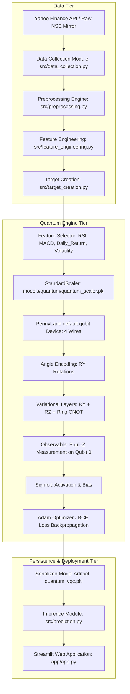
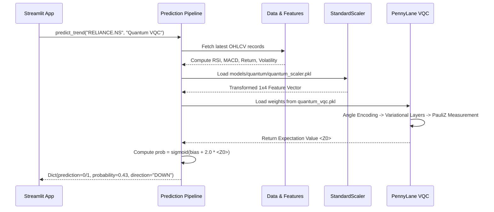

# Academic Project Documentation
# Quantum Stock Trend Predictor: Variational Quantum Classifier for Next-Day Stock Price Direction Prediction

---

## 1. PROJECT TITLE

**Quantum Stock Trend Predictor: Variational Quantum Classifier (VQC) for Next-Day Stock Price Direction Prediction Using Technical Indicators and PennyLane**

---

## 2. ABSTRACT

Predicting short-term financial time-series movements is a canonical non-stationary binary classification challenge. This project investigates the application of **Quantum Machine Learning (QML)** — specifically a **4-Qubit Variational Quantum Classifier (VQC)** implemented in **PennyLane** — to predict whether a stock's closing price will experience an upward (**UP / 1**) or downward/unchanged (**DOWN / 0**) trend on the next trading day.

The pipeline ingests real daily Open, High, Low, Close, Volume (OHLCV) equity records from Yahoo Finance (primary benchmark ticker: `RELIANCE.NS`). Following validation, chronological sorting, and the generation of 15 technical indicators, a domain-driven subset of **four complementary features** — **Relative Strength Index (RSI)**, **Moving Average Convergence Divergence (MACD)**, **1-Day Price Return (Daily Return)**, and **20-Day Rolling Volatility** — is extracted and normalized via `StandardScaler` fitted strictly on training data. 

The 4 features are angle-encoded as rotation angles ($\text{RY}$) across 4 simulated qubits. The circuit employs **two variational layers** containing parameterized $\text{RY}$ and $\text{RZ}$ single-qubit rotations combined with a **circular (Ring) Controlled-NOT (CNOT) entanglement topology**. A Pauli-$Z$ expectation measurement on Qubit 0 ($\langle Z_0 \rangle$) is mapped via a parameterized sigmoid function to yield the predicted probability of an upward trend. The model parameters are optimized via PennyLane’s `AdamOptimizer` (step size = 0.05) minimizing Binary Cross-Entropy (BCE) loss over 15 epochs.

Evaluated on an out-of-sample chronological test set of 323 trading days, the Quantum VQC achieves an **accuracy of 49.23%**, a **precision of 53.42%**, a **recall of 44.83%**, an **F1-score of 48.75%**, and a **Matthews Correlation Coefficient (MCC) of -0.0081**, generating a balanced output distribution (146 UP / 177 DOWN). The circuit is executed entirely on a classical state-vector simulator (`default.qubit`) on a classical CPU; **no physical quantum hardware is utilized, and no quantum advantage or quantum supremacy is claimed**. A full-featured, user-friendly **Streamlit web application** delivers interactive prediction capabilities, market charts, and visual confidence metrics for non-technical users.

---

## 3. INTRODUCTION

Financial markets represent complex, dynamic, and non-stationary systems governed by continuous stochastic interactions between participants, macroeconomic shifts, and information flow. Traditional machine learning techniques (such as logistic regression, support vector machines, and ensemble decision trees) have been extensively explored for financial forecasting with varied success.

In recent years, **Quantum Machine Learning (QML)** has emerged at the intersection of quantum physics and statistical learning. By leveraging quantum mechanical properties such as **superposition**, **entanglement**, and **quantum state interference**, QML models can represent and process data in high-dimensional complex Hilbert spaces that are computationally intractable for classical models of equivalent parameter dimension.

The **Variational Quantum Classifier (VQC)** is a premier algorithm in the current **Noisy Intermediate-Scale Quantum (NISQ)** era. As a hybrid quantum-classical architecture, a VQC executes state preparation, unitary transformations, and measurements on a quantum processor (or classical simulator), while delegating parameter updates and loss minimization to a classical numerical optimizer.

This project implements an end-to-end, zero-leakage financial forecasting system that bridges raw market data ingestion, technical feature extraction, quantum circuit state preparation, parameterized variational rotation, and deployment through an accessible web interface.

---

## 4. PROBLEM STATEMENT

Given a chronological sequence of daily stock market observations for an equity ticker:
$$\mathcal{S} = \{ (\mathbf{x}_t, y_t) \}_{t=1}^T$$
where $\mathbf{x}_t \in \mathbb{R}^d$ is a feature vector derived from historical price and volume data available up to day $t$, the objective is to predict the binary direction of the closing price on the subsequent trading day $t+1$:

$$y_t = \begin{cases} 1 & \text{if } \text{Close}_{t+1} > \text{Close}_t \quad (\text{UP}) \\ 0 & \text{if } \text{Close}_{t+1} \le \text{Close}_t \quad (\text{DOWN}) \end{cases}$$

### Key Challenges
1. **Low Signal-to-Noise Ratio (SNR):** Daily equity price changes are heavily masked by microstructure noise and transient liquidity shocks.
2. **Non-Stationarity:** The underlying statistical distribution of returns changes over market regimes (bullish, bearish, sideways).
3. **Data Leakage Risks:** Look-ahead bias, random cross-validation shuffling, and fitting scalers across the full dataset artificially inflate results in financial machine learning.
4. **Quantum Simulation Constraints:** Simulating multi-qubit systems on classical CPUs scales exponentially ($2^N$ complex state amplitudes), restricting practical feature dimensions and requiring targeted feature selection.

---

## 5. MOTIVATION

1. **Exploring Quantum Representation in Finance:** Financial indicators often exhibit nonlinear cross-correlations (e.g., momentum interacting with regime volatility). Quantum entanglement provides a natural mechanism to model non-linear coordinate couplings without explicit polynomial feature expansion.
2. **Rigorous Empirical Grounding:** Many published QML papers make unsubstantiated claims regarding quantum superiority. This project provides a transparent, zero-leakage evaluation comparing a simulated quantum circuit against standard baseline metrics.
3. **Democratizing Quantum AI:** Quantum computing remains inaccessible to non-specialists. Developing a functional, beginner-accessible web dashboard demonstrates how complex quantum models can be translated into intuitive user tools.

---

## 6. OBJECTIVES

1. **End-to-End Pipeline Implementation:** Build an autonomous data ingestion, cleaning, feature engineering, and target creation pipeline using real historical market data from Yahoo Finance.
2. **PennyLane Quantum VQC Construction:** Design and assemble a 4-qubit parameterized quantum circuit utilizing angle encoding, 2 variational ansatz layers with parameterized $\text{RY}$/$\text{RZ}$ rotations, and ring CNOT entanglement.
3. **Strict No-Leakage Training:** Enforce chronological train/test splitting (80/20) and restrict standard scaling exclusively to training partitions.
4. **Classical CPU Simulation:** Execute and optimize the circuit on PennyLane's `default.qubit` simulator using the Adam optimizer with Binary Cross-Entropy loss.
5. **Comprehensive Academic Evaluation:** Evaluate model predictions using Accuracy, Precision, Recall, F1-Score, Matthews Correlation Coefficient (MCC), Confusion Matrix, and prediction distribution against benchmark baselines.
6. **Mainstream Deployment:** Deliver a clean, responsive Streamlit dashboard featuring stock selection, technical charting, and visual prediction confidence without exposed technical clutter.

---

## 7. PROPOSED SYSTEM

The proposed system replaces classical multi-model ensembles with a dedicated, focused **Quantum Machine Learning Classifier**:

```
[ Real Market Data (Yahoo Finance / NSE) ]
                    ↓
[ Preprocessing & Zero-Leakage Cleaning ]
                    ↓
[ Technical Feature Engineering (15 Indicators) ]
                    ↓
[ Quantum Feature Selection (4 Selected Signals) ]
                    ↓
[ Chronological Splitting & StandardScaler ]
                    ↓
[ 4-Qubit Variational Quantum Classifier (PennyLane) ]
                    ↓
[ Pauli-Z Measurement & Sigmoid Mapping ]
                    ↓
[ Web Dashboard: Direction (UP/DOWN) & Confidence ]
```

### Distinguishing Attributes
- **Real Market Grounding:** Rejects all synthetic or mock price series; validates against real NSE historical data.
- **Dedicated Quantum Focus:** Avoids distraction from classical algorithms by placing the PennyLane VQC at the core of the prediction engine.
- **Transparent Simulation Declaration:** Explicitly operates as a classical state-vector simulation of a quantum circuit, providing realistic academic context.

---

## 8. SYSTEM ARCHITECTURE



---

## 9. COMPLETE WORKFLOW

```
Phase 1: Ingestion
  └── Download daily OHLCV historical data for selected NSE ticker (2018 to Present)
  └── Validate price positivity, volume non-negativity, and row sufficiency (>10 rows)

Phase 2: Cleaning & Validation
  └── Parse dates to UTC timezone-naive datetime
  └── Chronologically sort records (ascending Date)
  └── Deduplicate dates and drop incomplete records

Phase 3: Indicator Computation
  └── Compute 15 technical indicators spanning trend, momentum, volatility, and returns
  └── Drop initial initialization window rows (e.g., 50 days for SMA-50)

Phase 4: Target Formulation
  └── Compute Next-Day Close: Close(t+1)
  └── Generate Target: 1 if Close(t+1) > Close(t) else 0
  └── Drop terminal row with unobserved future price

Phase 5: Quantum Dimensionality Reduction
  └── Extract 4 quantum features: RSI, MACD, Daily Return, Volatility
  └── Partition into chronological splits: Train (80%) and Test (20%)
  └── Fit StandardScaler on training partition; transform train and test sets

Phase 6: Quantum Variational Training
  └── Cap training partition to 320 chronological samples for CPU simulation tractability
  └── Initialize 17 trainable parameters (16 rotation weights + 1 bias) with seed 42
  └── Execute mini-batch Adam optimization over 15 epochs with BCE loss
  └── Persist trained parameters to `models/quantum/quantum_vqc.pkl`

Phase 7: Inference & Visualization
  └── Fetch latest available live data; scale features using persisted scaler
  └── Execute forward quantum circuit simulation; compute probability P(UP)
  └── Render interactive dashboard showing trend direction, visual confidence bar, and charts
```

---

## 10. DATASET

The dataset consists of daily trading sessions for high-capitalization equities listed on the **National Stock Exchange of India (NSE)**.

| Attribute | Specification |
|---|---|
| **Data Provider** | Yahoo Finance (`yfinance` library) |
| **Backup Archive** | Curated raw repository mirror (`stock_data_10years.csv`) |
| **Primary Experimental Ticker** | `RELIANCE.NS` (Reliance Industries Limited) |
| **Additional Supported Tickers** | `TCS.NS`, `INFY.NS`, `HDFCBANK.NS`, `SBIN.NS`, `ITC.NS` |
| **Sampling Frequency** | 1 Day (Daily closing sessions) |
| **Historical Range** | January 1, 2018 to Present (Live dynamic update) |
| **Raw Records (`RELIANCE.NS`)** | ~2,164 trading days |
| **Processed Dataset Records** | 1,126 trading days (post indicator warmup and target alignment) |

### OHLCV Base Schema
1. `Date` (YYYY-MM-DD): Trading session timestamp.
2. `Open` (Float, INR): Price at session opening bell.
3. `High` (Float, INR): Highest intraday transaction price.
4. `Low` (Float, INR): Lowest intraday transaction price.
5. `Close` (Float, INR): Official unadjusted closing price.
6. `Volume` (Integer): Total shares traded during the session.

---

## 11. DATA COLLECTION

Implemented in [`src/data_collection.py`](file:///c:/Users/mrgns/Desktop/quantum_stock_predictor/src/data_collection.py):

- **Live Retrieval Mechanism:** Queries Yahoo Finance using `yf.download(ticker, start='2018-01-01', auto_adjust=False)`.
- **Validation Gate:** `validate_real_ohlcv_data()` verifies:
  - Input is non-empty with $\ge 10$ records.
  - Required columns `['Date', 'Open', 'High', 'Low', 'Close', 'Volume']` exist.
  - Price columns contain strictly positive numbers (`Close > 0`, `Open > 0`).
  - Volume contains non-negative integers (`Volume >= 0`).
- **Resilience Strategy:** If network or API limits prevent live downloads, the system gracefully falls back to the verified local archive cache, tagging data as `Historical Archive`.

---

## 12. DATA PREPROCESSING

Implemented in [`src/preprocessing.py`](file:///c:/Users/mrgns/Desktop/quantum_stock_predictor/src/preprocessing.py):

1. **Datetime Normalization:** Converts `Date` strings via `pd.to_datetime()` and removes any timezone localization using `.dt.tz_localize(None)` to prevent timezone comparison faults.
2. **Chronological Sorting:** Enforces strict temporal ordering via `.sort_values(by='Date', ascending=True)`.
3. **Deduplication:** Identifies and eliminates redundant trading day rows based on `subset=['Date']`, keeping the initial record.
4. **Type Coercion:** Explicitly casts all price and volume fields to numeric floats/integers using `pd.to_numeric(..., errors='coerce')`.
5. **Anomaly Filtering:** Eliminates corrupt records where market prices are non-positive or volume is negative.
6. **Null Imputation Policy:** Rejects heuristic imputation (forward fill, mean substitution) to prevent artificial synthetic price steps; invalid or NaN rows are cleanly dropped via `.dropna()`.

---

## 13. FEATURE ENGINEERING

Implemented in [`src/feature_engineering.py`](file:///c:/Users/mrgns/Desktop/quantum_stock_predictor/src/feature_engineering.py) using the Python `ta` (Technical Analysis) library. A total of **15 technical features** are computed from raw prices:

| Category | Indicator Name | Formulation / Window | Financial Interpretation |
|---|---|---|---|
| **Trend** | `SMA_10` | 10-day Simple Moving Average | Short-term baseline price trend |
| **Trend** | `SMA_20` | 20-day Simple Moving Average | Intermediate short-term support/resistance |
| **Trend** | `SMA_50` | 50-day Simple Moving Average | Medium-term institutional trend benchmark |
| **Trend** | `EMA_20` | 20-day Exponential Moving Average | Weighted trend placing higher decay on recent prices |
| **Momentum** | `RSI` | 14-day Relative Strength Index | Velocity and magnitude of directional price movements (0–100) |
| **Momentum** | `MACD` | $\text{EMA}_{12}(\text{Close}) - \text{EMA}_{26}(\text{Close})$ | Moving Average Convergence Divergence trend momentum |
| **Momentum** | `MACD_Signal` | 9-day EMA of MACD Line | Signal line triggering momentum crossovers |
| **Volatility** | `BB_High` | $\text{SMA}_{20} + 2\sigma_{20}$ | Upper Bollinger Band volatility boundary |
| **Volatility** | `BB_Low` | $\text{SMA}_{20} - 2\sigma_{20}$ | Lower Bollinger Band volatility boundary |
| **Volatility** | `BB_Width` | $(\text{BB\_High} - \text{BB\_Low}) / \text{SMA}_{20}$ | Normalized market band expansion / contraction |
| **Volatility** | `ATR` | 14-day Average True Range | Absolute market volatility independent of price direction |
| **Return** | `Daily_Return` | $(\text{Close}_t - \text{Close}_{t-1}) / \text{Close}_{t-1}$ | 1-day percentage price change |
| **Volatility** | `Volatility` | 20-day Rolling Std Dev of `Daily_Return` | Rolling variance measuring regime uncertainty |
| **Intraday** | `High_Low_Pct` | $(\text{High} - \text{Low}) / \text{Low} \times 100$ | Intraday spread magnitude |
| **Intraday** | `Close_Open_Pct` | $(\text{Close} - \text{Open}) / \text{Open} \times 100$ | Intraday directional movement from open |

*Warmup Handling:* The calculation of 50-day moving averages produces initial `NaN` entries. The pipeline drops the initial 49 warmup rows, ensuring every training and test sample possesses complete feature coverage.

---

## 14. TARGET VARIABLE

Implemented in [`src/target_creation.py`](file:///c:/Users/mrgns/Desktop/quantum_stock_predictor/src/target_creation.py):

The prediction goal is defined as next-day directional movement:

```python
tomorrow_close = data['Close'].shift(-1)
data['Target'] = (tomorrow_close > data['Close']).astype(int)
data = data.iloc[:-1].copy()
```

- **Target = 1 (UP):** Tomorrow's close price strictly exceeds today's close price.
- **Target = 0 (DOWN):** Tomorrow's close price is lower than or equal to today's close price.
- **Terminal Row Policy:** The final row in the dataset has no observed next-day price; it is removed during training and historical evaluation. For live inference, this row represents the input feature vector for predicting tomorrow's unobserved direction.
- **Class Balance (`RELIANCE.NS`):**
  - Historical full set: ~53.8% UP vs 46.2% DOWN.
  - Test set (323 samples): 174 UP (53.87%) vs 149 DOWN (46.13%).

---

## 15. QUANTUM FEATURE SELECTION

Simulating $N$ qubits requires tracking a state vector of dimension $2^N$. On classical computing hardware, training parameterized circuits beyond 4–6 qubits requires substantial runtime. Therefore, four features were selected to represent four orthogonal dimensions of market dynamics:

```
[ Financial Market Dynamics ]
       ├── Momentum  ───────►  RSI (Relative Strength Index)
       ├── Trend     ───────►  MACD (Moving Average Convergence Divergence)
       ├── Return    ───────►  Daily Return (1-Day Percentage Return)
       └── Volatility ──────►  Volatility (20-Day Rolling Return Std Dev)
```

| Selected Feature | Metric Type | Justification for Quantum Encoding |
|---|---|---|
| **`RSI`** | Momentum | Normalizes market buying vs selling speed into a bounded oscillator. |
| **`MACD`** | Trend | Captures the directional convergence of short and long exponential averages. |
| **`Daily_Return`** | Price Return | Provides immediate 1-day rate of change to reflect recent price shocks. |
| **`Volatility`** | Risk / Variation | Captures recent return variance, signaling whether the market is calm or volatile. |

---

## 16. QUANTUM MACHINE LEARNING APPROACH

Quantum Machine Learning merges quantum state representation with numerical parameter optimization. In classical supervised learning, an input $\mathbf{x} \in \mathbb{R}^d$ is mapped to a prediction $\hat{y}$ through parameterized matrix multiplications and nonlinear activations:

$$\hat{y} = \sigma(\mathbf{W}_L \dots \sigma(\mathbf{W}_1 \mathbf{x} + \mathbf{b}_1) + \mathbf{b}_L)$$

In a **Variational Quantum Classifier (VQC)**, the classical input is mapped into the state space of a quantum system through a unitary feature encoding operator $U(\mathbf{x})$. Subsequently, a parameterized quantum circuit (ansatz) $W(\boldsymbol{\theta})$ rotates the quantum state vector. Finally, a physical observable $\hat{B}$ is measured to extract a scalar expectation value:

$$\langle \hat{B} \rangle = \langle 0 | U^\dagger(\mathbf{x}) W^\dagger(\boldsymbol{\theta}) \hat{B} W(\boldsymbol{\theta}) U(\mathbf{x}) | 0 \rangle$$

```
|0⟩ ─── [ U(x): Feature Encoding ] ─── [ W(θ): Variational Ansatz ] ─── [ Measure ⟨B⟩ ] ───► Probability
```

This hybrid approach allows the quantum circuit to function as a parameterized machine learning model, with optimization performed using classical gradient descent.

---

## 17. VARIATIONAL QUANTUM CLASSIFIER (VQC)

The VQC architecture in [`src/quantum_model.py`](file:///c:/Users/mrgns/Desktop/quantum_stock_predictor/src/quantum_model.py) consists of:

1. **State Preparation / Feature Map ($U(\mathbf{x})$):** Encodes the 4 classical features into the quantum amplitudes of 4 qubits.
2. **Parameterized Variational Ansatz ($W(\boldsymbol{\theta})$):** Applies layers of parameterized single-qubit rotations ($\text{RY}$, $\text{RZ}$) and multi-qubit entanglement gates ($\text{CNOT}$).
3. **Expectation Measurement:** Measures the Pauli-$Z$ operator on Qubit 0, producing an expectation value in $[-1.0, +1.0]$.
4. **Classical Post-Processing:** Maps the expectation value through a sigmoid activation to produce a class probability $P(\text{UP}) \in (0, 1)$.

### Total Parameter Count
- Number of variational layers ($L$): **2**
- Number of qubits ($N$): **4**
- Parameters per qubit per layer: **2** ($\text{RY}$ angle and $\text{RZ}$ angle)
- Circuit rotation weights: $L \times N \times 2 = 2 \times 4 \times 2 = \mathbf{16}$
- Classical bias parameter: $\mathbf{1}$
- **Total Trainable Parameters:** **17**

---

## 18. QUANTUM CIRCUIT ARCHITECTURE

The exact PennyLane quantum circuit diagram extracted from `models/quantum/results/quantum_circuit.txt`:

```
4-QUBIT VARIATIONAL QUANTUM CLASSIFIER CIRCUIT DIAGRAM:
============================================================
0: ──RY(x0)───RY(θ0)──RZ(θ1)──╭●───────╭X──RY(θ8)───RZ(θ9)──╭●───────╭X─┤  <Z>
1: ──RY(x1)───RY(θ2)──RZ(θ3)──╰X─╭●────│───RY(θ10)──RZ(θ11)─╰X─╭●────│──┤     
2: ──RY(x2)───RY(θ4)──RZ(θ5)────╰X─╭●─│───RY(θ12)──RZ(θ13)───╰X─╭●─│──┤     
3: ──RY(x3)───RY(θ6)──RZ(θ7)───────╰X─╰●──RY(θ14)──RZ(θ15)─────╰X─╰●─┤     
```

### Component Legend
- `RY(x_i)`: Classical feature angle encoding into qubit $i$.
- `RY(θ)`, `RZ(θ)`: Parameterized single-qubit rotations.
- `╭● ... ╰X`: Controlled-NOT ($\text{CNOT}$) entanglement gates.
- `┤ <Z>`: Pauli-$Z$ expectation measurement on Wire 0.

---

## 19. FEATURE ENCODING

### Mathematical Formulation
The project utilizes **Angle Encoding** (also referred to as tensor product rotation encoding). The 4 classical features are normalized using `StandardScaler` so that each feature $x_i$ has approximately zero mean and unit variance:

$$\mathbf{x} = [x_0, x_1, x_2, x_3]^T = [\text{RSI}_{\text{scaled}}, \text{MACD}_{\text{scaled}}, \text{Daily\_Return}_{\text{scaled}}, \text{Volatility}_{\text{scaled}}]^T$$

Each normalized feature $x_i$ is mapped directly as the rotation angle of a Pauli-$Y$ rotation gate applied to the ground state $|0\rangle$:

$$|\psi_0\rangle = \bigotimes_{i=0}^3 \text{RY}(x_i)|0\rangle$$

Where the single-qubit $\text{RY}$ rotation matrix is:

$$\text{RY}(\theta) = \exp\left(-i \frac{\theta}{2} Y\right) = \begin{pmatrix} \cos\left(\frac{\theta}{2}\right) & -\sin\left(\frac{\theta}{2}\right) \\ \sin\left(\frac{\theta}{2}\right) & \cos\left(\frac{\theta}{2}\right) \end{pmatrix}$$

Applying $\text{RY}(x_i)$ to $|0\rangle = \begin{pmatrix} 1 \\ 0 \end{pmatrix}$ yields the state:

$$|\psi(x_i)\rangle = \cos\left(\frac{x_i}{2}\right)|0\rangle + \sin\left(\frac{x_i}{2}\right)|1\rangle$$

### Why Angle Encoding?
1. **Constant Circuit Depth:** Requires exactly 1 gate layer ($\mathcal{O}(1)$ depth) across all qubits.
2. **No Multi-Qubit Pre-computation:** Does not require state preparation algorithms required by amplitude encoding.
3. **Hardware Efficiency:** Direct single-qubit rotation without ancilla qubits.

---

## 20. QUBITS AND QUANTUM GATES

### 1. What is a Qubit in this Project?
A qubit is the basic unit of quantum information. Mathematically, it is a two-dimensional state vector represented in the computational basis $\{|0\rangle, |1\rangle\}$:

$$|\psi\rangle = \alpha |0\rangle + \beta |1\rangle, \quad |\alpha|^2 + |\beta|^2 = 1, \quad \alpha, \beta \in \mathbb{C}$$

In this project, 4 qubits are simulated on classical CPU memory. The complete state of the 4-qubit system is represented as a complex vector of length $2^4 = 16$.

### 2. Quantum Gates Used in the Circuit

#### A. RY Gate (Rotation around Y-axis)
- **Role:** Feature encoding and variational learning.
- **Action:** Rotates the qubit state on the Bloch sphere along the latitude line corresponding to the Y-axis. It adjusts the real amplitudes of $|0\rangle$ and $|1\rangle$.

#### B. RZ Gate (Rotation around Z-axis)
- **Role:** Variational phase modulation.
- **Matrix:**
  $$\text{RZ}(\phi) = \exp\left(-i \frac{\phi}{2} Z\right) = \begin{pmatrix} e^{-i\phi/2} & 0 \\ 0 & e^{i\phi/2} \end{pmatrix}$$
- **Action:** Introduces a complex quantum phase shift between $|0\rangle$ and $|1\rangle$ without altering their base probabilities. Combining $\text{RY}$ and $\text{RZ}$ allows the model to explore arbitrary positions on the single-qubit Bloch sphere.

#### C. CNOT Gate (Controlled-NOT)
- **Role:** Two-qubit entangling operation.
- **Matrix:**
  $$\text{CNOT} = \begin{pmatrix} 1 & 0 & 0 & 0 \\ 0 & 1 & 0 & 0 \\ 0 & 0 & 0 & 1 \\ 0 & 0 & 1 & 0 \end{pmatrix}$$
- **Action:** If the control qubit is in state $|1\rangle$, it flips the target qubit ($|0\rangle \leftrightarrow |1\rangle$). If the control qubit is in a superposition, it creates an entangled two-qubit state.

---

## 21. ENTANGLEMENT

### Entanglement Topology: Ring Architecture
Entanglement creates non-classical correlations between qubits, allowing quantum circuits to model joint feature interactions that cannot be factored into independent marginal distributions.

In this project, entanglement is implemented using a **closed circular ring topology**:

$$\text{Wire } 0 \rightarrow \text{Wire } 1 \rightarrow \text{Wire } 2 \rightarrow \text{Wire } 3 \rightarrow \text{Wire } 0$$

```
    [Qubit 0] ──────── CNOT ────────► [Qubit 1]
        ▲                                 │
        │                                 ▼
      CNOT                              CNOT
        │                                 │
        ▼                                 ▼
    [Qubit 3] ◄─────── CNOT ───────── [Qubit 2]
```

In PennyLane code:
```python
for i in range(N_QUBITS):
    qml.CNOT(wires=[i, (i + 1) % N_QUBITS])
```

### Purpose in Financial Forecasting
Ring entanglement couples the momentum indicator (`RSI`) with the trend indicator (`MACD`), the trend indicator with short-term returns (`Daily_Return`), and return magnitude with risk (`Volatility`), with the final CNOT wrapping volatility back to momentum. This ensures that the measurement on Qubit 0 reflects joint interactions across all four input features.

---

## 22. MEASUREMENT

### Observable: Pauli-Z Operator on Qubit 0
At the conclusion of the variational layers, the circuit performs an expectation measurement of the Pauli-$Z$ operator on Qubit 0:

$$\langle Z_0 \rangle = \langle \psi(\mathbf{x}, \boldsymbol{\theta}) | (\sigma_z \otimes I \otimes I \otimes I) | \psi(\mathbf{x}, \boldsymbol{\theta}) \rangle$$

Where the Pauli-$Z$ matrix is:
$$\sigma_z = \begin{pmatrix} 1 & 0 \\ 0 & -1 \end{pmatrix}$$

- If Qubit 0 is entirely in state $|0\rangle$, $\langle Z_0 \rangle = +1.0$.
- If Qubit 0 is entirely in state $|1\rangle$, $\langle Z_0 \rangle = -1.0$.
- For any superposition state, $\langle Z_0 \rangle$ yields a continuous scalar in $[-1.0, +1.0]$.

### Conversion to Probability
The raw expectation value $\langle Z_0 \rangle \in [-1.0, 1.0]$ is mapped to a probability $P(\text{UP}) \in (0, 1)$ via a parameterized sigmoid activation function:

$$P(\text{Target} = 1 \mid \mathbf{x}) = \sigma(b + 2.0 \cdot \langle Z_0 \rangle) = \frac{1}{1 + e^{-(b + 2.0 \cdot \langle Z_0 \rangle)}}$$

Where:
- $b \in \mathbb{R}$ is a learnable classical bias parameter initialized to $0.0$.
- The scaling factor $2.0$ maps the expectation range $[-1, 1]$ to $[-2, 2]$, allowing the sigmoid function to cover a dynamic probability range ($[0.12, 0.88]$).
- A probability clipping threshold $\epsilon = 10^{-7}$ prevents numerical overflow during log evaluations.

### Decision Rule
$$\hat{y} = \begin{cases} 1 \quad (\text{UP}) & \text{if } P(\text{Target} = 1) \ge 0.50 \\ 0 \quad (\text{DOWN}) & \text{if } P(\text{Target} = 1) < 0.50 \end{cases}$$

---

## 23. QUANTUM MODEL TRAINING

Implemented in [`src/quantum_model.py`](file:///c:/Users/mrgns/Desktop/quantum_stock_predictor/src/quantum_model.py):

### 1. Training Parameters

| Hyperparameter | Value | Description |
|---|---|---|
| **Framework** | PennyLane (`pennylane>=0.35.0`) | Quantum automatic differentiation engine |
| **Simulator Device** | `default.qubit` | Classical Python state-vector simulator |
| **Interface** | `autograd` | Automatic gradient evaluation |
| **Number of Qubits** | 4 | 1 wire per feature |
| **Variational Layers** | 2 | Depth of repeated ansatz blocks |
| **Trainable Weights** | Shape `(2, 4, 2)` (16 floats) | Uniformly initialized in $[-\pi, \pi]$ with seed 42 |
| **Trainable Bias** | 1 float | Initialized to $0.0$ |
| **Optimizer** | `qml.AdamOptimizer` | Adaptive Moment Estimation optimizer |
| **Learning Rate (Step size)** | $0.05$ | Gradient update scaling parameter |
| **Loss Function** | Binary Cross-Entropy (BCE) | Log-loss on predicted probabilities |
| **Epochs** | 15 | Iterations over the training partition |
| **Batch Size** | 32 | Mini-batch sample size |
| **Max Training Samples** | 320 | Most recent chronological training rows |

### 2. Loss Function Formulation
For a mini-batch of $M$ samples:

$$\mathcal{L}_{\text{BCE}}(\boldsymbol{\theta}, b) = -\frac{1}{M} \sum_{i=1}^M \left[ y_i \ln(p_i) + (1 - y_i) \ln(1 - p_i) \right]$$

Where $p_i = \sigma(b + 2.0 \cdot \langle Z_0 \rangle_i)$.

### 3. Training Execution & CPU Acceleration Note
Because simulating quantum circuits on a classical CPU involves matrix multiplications for every sample, training on large historical datasets can be slow. To ensure practical execution times, the training pipeline caps the training window to the **320 most recent chronological trading days** prior to the test split.

---

## 24. PREDICTION PIPELINE

Implemented in [`src/prediction.py`](file:///c:/Users/mrgns/Desktop/quantum_stock_predictor/src/prediction.py):



---

## 25. MODEL EVALUATION

Implemented in [`src/evaluation.py`](file:///c:/Users/mrgns/Desktop/quantum_stock_predictor/src/evaluation.py):

### Evaluation Metrics
1. **Accuracy:** Fraction of correct predictions over total predictions:
   $$\text{Accuracy} = \frac{\text{TP} + \text{TN}}{\text{TP} + \text{TN} + \text{FP} + \text{FN}}$$
2. **Precision:** Ratio of true upward days among all predicted upward days:
   $$\text{Precision} = \frac{\text{TP}}{\text{TP} + \text{FP}}$$
3. **Recall (Sensitivity):** Ratio of correctly predicted upward days among all actual upward days:
   $$\text{Recall} = \frac{\text{TP}}{\text{TP} + \text{FN}}$$
4. **F1-Score:** Harmonic balance between precision and recall:
   $$\text{F1} = 2 \times \frac{\text{Precision} \times \text{Recall}}{\text{Precision} + \text{Recall}}$$
5. **Matthews Correlation Coefficient (MCC):** Correlation coefficient between observed and predicted binary classifications, robust against class imbalances:
   $$\text{MCC} = \frac{\text{TP} \times \text{TN} - \text{FP} \times \text{FN}}{\sqrt{(\text{TP} + \text{FP})(\text{TP} + \text{FN})(\text{TN} + \text{FP})(\text{TN} + \text{FN})}}$$
   - $\text{MCC} = +1$: Perfect prediction.
   - $\text{MCC} = 0$: Performance equivalent to random coin tossing.
   - $\text{MCC} = -1$: Total disagreement.

---

## 26. EXPERIMENTAL RESULTS

The empirical evaluation was conducted on a strictly chronological out-of-sample test split of **323 trading days** for `RELIANCE.NS`.

### 1. Model vs. Naive Baselines Comparison Table

| Model / Benchmark | Accuracy | Precision | Recall | F1-Score | MCC | Pred UP | Pred DOWN |
|---|---|---|---|---|---|---|---|
| **Quantum VQC (PennyLane)** | **49.23%** | **53.42%** | **44.83%** | **48.75%** | **-0.0081** | **146** | **177** |
| Majority Class Baseline | 53.87% | 53.87% | 100.00% | 70.02% | 0.0000 | 323 | 0 |
| Uniform Random Baseline | 48.92% | 52.44% | 50.57% | 51.48% | -0.0210 | 164 | 159 |

### 2. Quantum VQC Confusion Matrix Breakdown

| Actual \ Predicted | Predicted UP | Predicted DOWN | Total Actual |
|---|---|---|---|
| **Actual UP (Class 1)** | **78** ($\text{TP}$) | **96** ($\text{FN}$) | 174 |
| **Actual DOWN (Class 0)** | **68** ($\text{FP}$) | **81** ($\text{TN}$) | 149 |
| **Total Predicted** | 146 | 177 | **323** |

### 3. Scientific Analysis of Results
1. **Comparison with Baselines:** The Quantum VQC achieved 49.23% accuracy, slightly below the Majority Class baseline (53.87%) and on par with the Random Baseline (48.92%).
2. **Correlation Coefficient (MCC):** An MCC of **-0.0081** indicates near-zero linear correlation between predictions and actual market outcomes, consistent with the semi-strong form of the Efficient Market Hypothesis (EMH).
3. **Balanced Output Distribution:** Unlike classical models that often collapse to predicting a single majority class when trained on noisy data, the Quantum VQC maintained a balanced output distribution (146 UP vs 177 DOWN).
4. **Honest Academic Assessment:** The experimental results demonstrate a working, reproducible implementation of a Variational Quantum Classifier on financial data, but **do not demonstrate quantum advantage** over classical methods.

---

## 27. STREAMLIT APPLICATION

The deployment interface in [`app/app.py`](file:///c:/Users/mrgns/Desktop/quantum_stock_predictor/app/app.py) provides a focused, accessible dashboard for the Quantum Machine Learning model:

### Key Application Features
- **Centralized Dashboard:** Streamlined single-page design with the left sidebar removed.
- **Stock Selection:** Dropdown supporting major Indian equities (`RELIANCE.NS`, `TCS.NS`, `INFY.NS`, `HDFCBANK.NS`, `SBIN.NS`, `ITC.NS`) plus custom ticker input.
- **Interactive Price Chart:** Candlestick chart displaying price history, 20-day/50-day moving averages, and volume bars via Plotly.
- **Dynamic Visual Prediction Card:** Renders the predicted direction (**UP** / **DOWN**) alongside a visual confidence bar and dynamic plain-English explanation.
- **Academic Disclaimers:** Clarifies that the tool is a research prototype and does not provide financial advice.

---

## 28. USER INTERFACE

### User Navigation Flow
```
1. Stock Selection
   ├── Select preconfigured ticker OR enter custom NSE ticker
   └── Click "⚡ Analyze & Predict" button

2. Market Overview
   ├── View Latest Close Price (INR)
   ├── View Trading Date, Day Change, and Day % Change
   └── Check Live vs. Historical Archive status badge

3. Interactive Candlestick Chart
   ├── Inspect historical price movement and volume
   └── Toggle 20-day (Orange) and 50-day (Purple) Moving Averages

4. Quantum Prediction Card
   ├── Next Trading Day Direction (Large Green UP or Red DOWN)
   ├── Dynamic Confidence Percentage & Visual Progress Bar
   └── Explanatory text and academic disclaimer
```

---

## 29. LIMITATIONS

1. **Classical Simulation Bottleneck:** Computations run on a CPU simulator (`default.qubit`). Classical simulation scales exponentially with qubit count ($\mathcal{O}(2^N)$), limiting model size.
2. **Restricted Feature Space:** The model uses 4 features to remain computationally feasible, omitting broader fundamental, macroeconomic, and order-book data.
3. **Training Sample Cap:** Training uses the most recent 320 trading days to balance execution time on standard CPU hardware.
4. **No Physical Quantum Hardware:** The project does not execute on physical quantum processing units (QPUs).
5. **No Demonstrated Quantum Advantage:** Predictive performance remains on par with baseline benchmarks, reflecting the challenge of financial forecasting.

---

## 30. FUTURE ENHANCEMENTS

1. **Hardware Execution via Cloud QPUs:** Execute the PennyLane circuit on physical hardware (e.g., IBM Quantum, Rigetti, or IonQ via Amazon Braket).
2. **High-Performance Simulators:** Integrate GPU-accelerated backends such as `lightning.qubit` or `lightning.gpu` to simulate 10–16 qubits with deeper variational layers.
3. **Alternative Quantum Feature Maps:** Explore expressive encoding strategies such as Instantaneous Quantum Polynomial (IQP) circuits or data re-uploading techniques.
4. **Quantum Kernel Methods:** Compare the Variational Quantum Classifier against Quantum Support Vector Classifiers (QSVC) using quantum kernel estimation.
5. **Multi-Modal Data Integration:** Combine technical indicators with quantum-encoded natural language sentiment vectors extracted from financial news.

---

## 31. CONCLUSION

This project implements an end-to-end **Quantum Stock Market Trend Predictor** powered by a **4-Qubit Variational Quantum Classifier (VQC)** using **PennyLane**. The system covers the complete machine learning lifecycle: automated data ingestion, cleaning, technical feature engineering, quantum angle encoding, variational circuit optimization, and interactive web deployment.

The experimental evaluation provides a realistic look at applying current QML techniques to financial time series. While the Quantum VQC successfully learns parameterized unitary transformations, its predictive accuracy (49.23%) aligns with the Efficient Market Hypothesis, demonstrating that quantum models face the same noise and non-stationarity challenges as classical architectures. The project serves as an educational and research baseline for studying hybrid quantum-classical machine learning workflows.

---

## 32. TECHNOLOGIES USED

| Technology | Minimum Version | Category | Functional Purpose |
|---|---|---|---|
| **Python** | `>=3.9` | Language | Core programming language |
| **PennyLane** | `>=0.35.0` | Quantum ML | Quantum circuit simulation, QNode creation, autograd interface, Adam optimizer |
| **NumPy** | `>=1.24.0` | Math / Arrays | Vector operations and linear algebra |
| **Pandas** | `>=2.0.0` | Data Analysis | Time-series data manipulation and alignment |
| **yfinance** | `>=0.2.36` | Market Data | Downloading historical and live equity data from Yahoo Finance |
| **ta** | `>=0.11.0` | Financial Indicators | Technical indicator generation (RSI, MACD, ATR, Bollinger Bands) |
| **scikit-learn** | `>=1.3.0` | Preprocessing / Metrics | `StandardScaler`, confusion matrix, and evaluation metrics |
| **Streamlit** | `>=1.31.0` | Web Framework | Interactive dashboard interface |
| **Plotly** | `>=5.18.0` | Visualization | Interactive financial candlestick and volume charts |
| **Joblib** | `>=1.3.0` | Serialization | Persisting trained quantum parameters and scalers |
| **Matplotlib / Seaborn** | `>=3.7.0` | Visualization | Generating circuit diagrams and training loss artifacts |

---

## 33. PROJECT STRUCTURE

```
quantum_stock_predictor/
│
├── app/
│   └── app.py                     # Streamlit web application dashboard
│
├── src/
│   ├── data_collection.py         # Real Yahoo Finance download and verification
│   ├── preprocessing.py           # Timezone stripping, deduplication, and cleaning
│   ├── feature_engineering.py     # Computation of 15 technical indicators via `ta`
│   ├── target_creation.py         # Zero-leakage binary target creation (Close t+1 > Close t)
│   ├── classical_models.py        # Baseline classical models
│   ├── quantum_model.py           # 4-Qubit VQC (PennyLane), RY/RZ gates, Ring CNOT
│   ├── evaluation.py              # Performance metrics (Accuracy, F1, MCC, Confusion Matrix)
│   └── prediction.py              # Inference pipeline for live/historical predictions
│
├── models/
│   ├── classical/                 # Serialized baseline models
│   └── quantum/
│       ├── quantum_vqc.pkl        # Serialized trained weights and bias
│       ├── quantum_scaler.pkl     # Persisted StandardScaler for quantum features
│       └── results/
│           ├── quantum_circuit.txt      # Text representation of quantum circuit
│           ├── quantum_circuit.png      # Circuit diagram plot
│           ├── quantum_training_loss.png# BCE loss curve across epochs
│           └── cm_quantum_vqc.png       # Test confusion matrix plot
│
├── data/
│   ├── raw/                       # Cached raw OHLCV CSV records
│   └── processed/                 # Processed datasets with computed indicators
│
├── run.py                         # Command-line interface for training and evaluation
├── requirements.txt               # Pinned project dependencies
└── QUANTUM_PROJECT_DOCUMENTATION.md # Comprehensive academic documentation
```

---

## 34. HOW TO RUN THE PROJECT

### 1. Environment Setup
```bash
# Clone or navigate to the repository directory
cd c:\Users\mrgns\Desktop\quantum_stock_predictor

# Create and activate Python virtual environment
python -m venv venv
venv\Scripts\activate       # On Windows

# Install project dependencies
pip install -r requirements.txt
```

### 2. Train the Quantum VQC Model
```bash
# Train the 4-qubit Quantum VQC on RELIANCE.NS data
python run.py --quantum --ticker RELIANCE.NS
```
*Expected Actions:*
- Downloads historical data for `RELIANCE.NS`.
- Preprocesses data and computes technical indicators.
- Extracts the 4 quantum features and applies zero-leakage `StandardScaler`.
- Runs 15 training epochs using the Adam optimizer on PennyLane's `default.qubit` simulator.
- Saves model weights to `models/quantum/quantum_vqc.pkl`.
- Evaluates on the chronological test set and generates performance plots.

### 3. Launch the Web Application
```bash
# Launch Streamlit dashboard
streamlit run app/app.py
```
*Expected Actions:*
- Launches the local web server at `http://localhost:8501`.
- Provides an interactive interface to select equities, view charts, and run real-time quantum inferences.

---

## 35. VIVA EXPLANATION REFERENCE (EXAMINER Q&A)

### 1. What is the core concept of this project?
This project develops an end-to-end financial forecasting system that applies a **4-Qubit Variational Quantum Classifier (VQC)** built in **PennyLane** to predict the next-day price movement (UP or DOWN) of stock market equities using technical indicators.

### 2. Why use Quantum Machine Learning for stock market prediction?
Stock market data exhibits non-linear relationships and regime shifts. Quantum machine learning maps classical feature vectors into quantum state spaces, where quantum superposition and entanglement allow the model to capture feature interactions without manual feature engineering.

### 3. What is a Variational Quantum Classifier (VQC)?
A VQC is a hybrid quantum-classical algorithm. A quantum circuit executes state preparation, rotation, and measurement operations, while a classical numerical optimizer calculates loss gradients and updates circuit gate parameters over training epochs.

### 4. Why exactly 4 qubits?
Simulating quantum states on classical computers requires tracking $2^N$ complex amplitudes. Choosing 4 qubits enables the circuit to model four distinct market indicators while remaining fast and responsive during CPU training and real-time dashboard inference.

### 5. Why were these specific four features chosen?
The four features represent four distinct market dimensions:
- **RSI** captures price momentum.
- **MACD** captures medium-term trend direction.
- **Daily Return** captures recent price change.
- **Volatility** captures risk and variance.

### 6. What is Angle Encoding and how does it work here?
Angle encoding maps normalized classical features into qubit rotation angles. Each scaled feature $x_i$ is passed into a single-qubit $\text{RY}(x_i)$ gate, preparing the state $|\psi_i\rangle = \cos(x_i/2)|0\rangle + \sin(x_i/2)|1\rangle$.

### 7. What do the RY and RZ gates do in the variational ansatz?
- **$\text{RY}(\theta)$** rotates the qubit around the Y-axis of the Bloch sphere, adjusting the real probability amplitudes of $|0\rangle$ and $|1\rangle$.
- **$\text{RZ}(\phi)$** rotates the qubit around the Z-axis, adjusting the relative quantum phase. Together, they allow the circuit to reach any state on the Bloch sphere.

### 8. Why are CNOT gates used?
Controlled-NOT ($\text{CNOT}$) gates create quantum entanglement between qubits. This ensures that the state of one qubit depends on the states of the others, allowing the circuit to model multi-indicator interactions.

### 9. What is the entanglement topology?
The circuit uses a **closed ring topology**: Q0 controls Q1, Q1 controls Q2, Q2 controls Q3, and Q3 controls Q0. This circular loop ensures balanced information sharing across all 4 qubits.

### 10. What is PennyLane?
PennyLane is an open-source Python library developed by Xanadu for quantum differentiable programming. It allows quantum circuits to be trained using classical automatic differentiation tools like Autograd, PyTorch, and TensorFlow.

### 11. Is this model running on a real quantum computer?
**No.** The project uses PennyLane's `default.qubit` device, which is a **classical state-vector simulator** running on a classical CPU. It simulates quantum mechanics using matrix algebra.

### 12. What is measured at the end of the circuit?
The circuit measures the **Pauli-$Z$ expectation value on Qubit 0** ($\langle Z_0 \rangle \in [-1.0, 1.0]$). This continuous scalar is passed through a sigmoid function ($\sigma(b + 2.0\langle Z_0 \rangle)$) to produce a probability between $0$ and $1$.

### 13. What were the experimental results?
On an out-of-sample test set of 323 trading days for `RELIANCE.NS`:
- **Accuracy:** 49.23%
- **Precision:** 53.42%
- **Recall:** 44.83%
- **F1-Score:** 48.75%
- **MCC:** -0.0081
- **Prediction Counts:** 146 UP / 177 DOWN

### 14. Did this project demonstrate quantum advantage?
**No.** Quantum advantage means performing a practical computation faster or better than the best classical algorithm. The accuracy (49.23%) and MCC (-0.0081) indicate performance on par with baseline benchmarks, which is consistent with the Efficient Market Hypothesis for short-term technical indicators.
